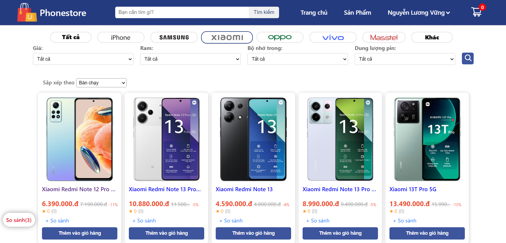
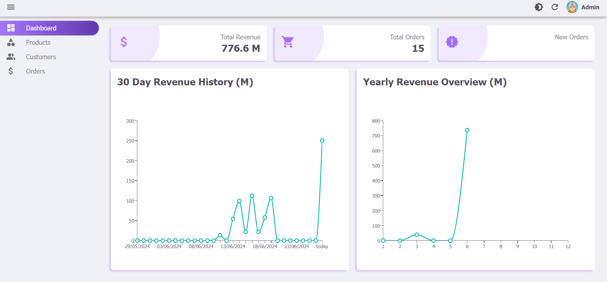

# Website bán điện thoại online

Video demo

- Mã nguồn FE phía user [tại đây](https://github.com/vung2k2/phonestore_web)

- Mã nguồn FE phía admin [tại đây](https://github.com/vung2k2/admin-phonestore)

- Mã nguồn BE phía user [tại đây]()

## Phía người dùng

Link web [tại đây](https://user-phonestore.vercel.app/) (lưu ý vui lòng đợi khoảng 1 phút để máy chủ khởi động trở lại)

Tài khoản test: nguyenluongvung@gmail.com - 1

Tài khoản VNPay: 9704198526191432198 - NGUYEN VAN A - 07/15 - 123456

Chức năng:
- Đăng ký, đăng nhập, lấy lại mật khẩu.
- Hiển thị danh sách sp, lọc sp, so sánh các sp.
- Chỉnh sửa thông tin cá nhân.
- Đặt hàng, xem lại đơn đã đặt, đánh giá sp.
- Tích hợp thanh toán VNPay.

## Phía admin

Link web [tại đây](https://admin-phonestore.vercel.app/) (lưu ý vui lòng đợi khoảng 1 phút để máy chủ khởi động trở lại)

Tài khoản test: admin@gmail.com - 1

Chức năng:
- Thống kê: tổng doanh thu, số đơn hàng đã bán, doanh thu 30 ngày gần nhất, doanh thu các tháng trong năm.
- Thao tác với bảng (tìm kiếm, ẩn/hiện cột, đổi vị trí các cột).
- Quản lý sp (thêm, sửa, xóa, xuất ds ra file .csv, nhập ds sp từ file excel)
- Quản lý tài khoản.
- Quản lý đơn hàng.

